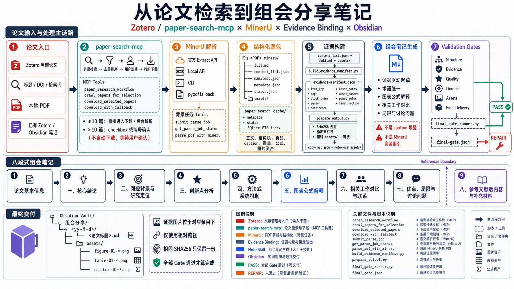
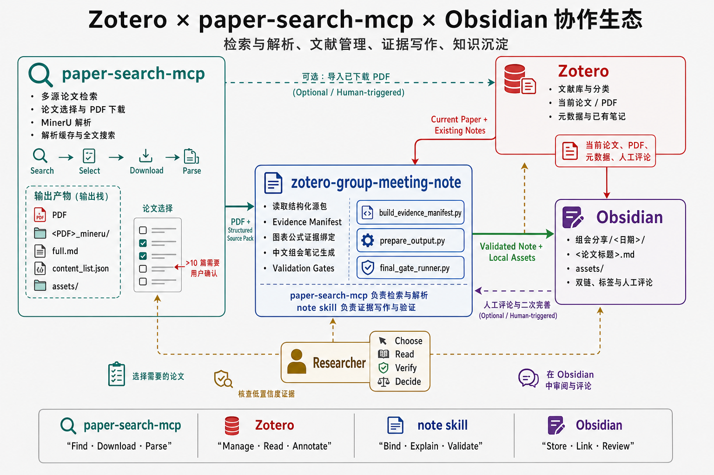
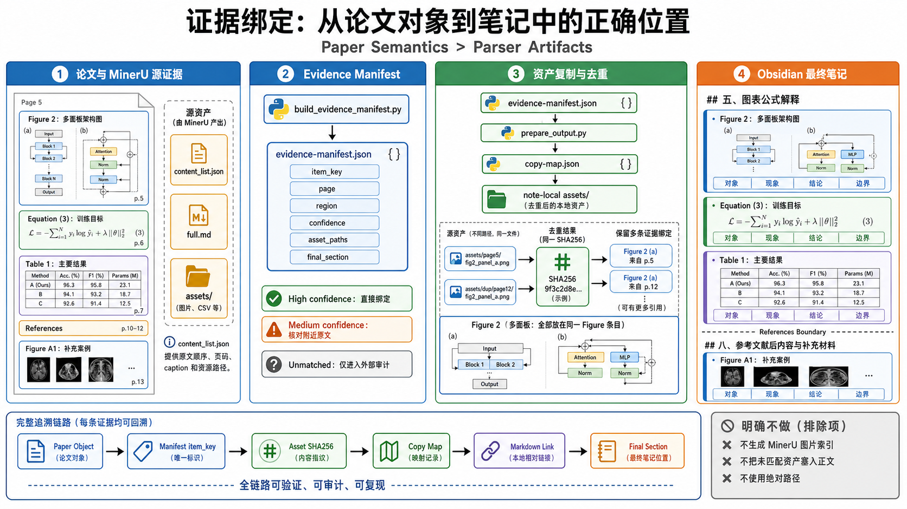

<h1 align="center">Zotero-Obsidian-Note</h1>
`zotero-group-meeting-note` 是一个面向 Codex 的中文研究生组会文献汇报 skill。它用于从 Zotero 当前论文、PDF、本地 MinerU 解析结果、`paper-search-mcp` 解析缓存、已有 Zotero/Obsidian 笔记或抽取后的 Markdown 中，生成可直接用于组会分享的深度中文笔记，并保存到 Obsidian 的 `组会分享/<日期>/` 目录。

<p align="center">
  
</p>

总览图展示了从论文入口、`paper-search-mcp` 检索下载、MinerU 结构化解析，到证据构建、组会笔记生成和 Validation Gates 的完整主链路。

### **推荐和 <a href="https://github.com/223nobody/paper-search-mcp" style="color:#31B0F2;text-decoration:underline;text-decoration-color:#31B0F2;">223nobody/paper-search-mcp</a> 一起使用**

`paper-search-mcp` 负责论文检索、下载、MinerU 解析和结构化缓存，本仓库的 skill 负责把解析后的正文、图表、公式和资产组织成 Obsidian 组会分享笔记。

它的目标不是复述摘要，而是帮助汇报者讲清：

- 论文解决了什么问题，为什么值得做。
- 相比已有路线真正新的地方在哪里。
- 方法或系统机制如何工作。
- 每张关键图、每个表、每个公式支撑了什么结论。
- 实验结果的可信边界、局限和讨论问题是什么。
- 参考文献后的 Appendix / Supplementary / Prompt / Case Study 等内容应该如何单独处理。

当前 skill 是对 Zotero + Obsidian + MinerU / `paper-search-mcp` 论文工作流的尝试，欢迎按自己的阅读和组会习惯继续改造。

## 协作生态

这套工作流中的工具各自承担不同职责：`paper-search-mcp` 负责检索、选择、下载和解析，Zotero 负责文献管理与阅读上下文，本仓库的 skill 负责证据绑定、解释、写作和验证，Obsidian 负责保存最终笔记、图片资产与人工评论。

<p align="center">
  
</p>

图中的实线表示确定的数据流，虚线表示可选或由研究者触发的操作。下载后的 PDF 可以选择导入 Zotero，Obsidian 中的人工评论也可以用于后续完善，但这些路径不代表后台自动双向同步。

## 推荐调用方式

### 直接生成组会笔记

```text
$zotero-group-meeting-note
请阅读当前论文和 MinerU 解析结果，生成一份详细的中文组会分享笔记，并保存到 Obsidian。
```

默认输出会遵循当前蓝图：

```markdown
# 组会分享笔记：<论文标题>

## 论文基本信息

## 一、核心结论

## 二、问题背景与研究定位

## 三、创新点分析

## 四、方法或系统机制

## 五、图表公式解释

## 六、与相关工作的对比与联系

## 七、优点、局限与讨论问题

## 八、参考文献后内容与补充材料
```

其中 `## 八、参考文献后内容与补充材料` 只在论文确有 Appendix、Supplementary Material、Additional Results、Prompt、Case Study、Implementation Details、Ethics、Checklist 等实质内容时出现。

### 强化已有笔记

```text
$zotero-group-meeting-note
请基于当前 Zotero/Obsidian 笔记继续完善，不要重写已有人工评论。重点补充创新点分析、核心图表公式解释、实验结论边界和相关工作对比。
```

### 指定输出位置

```text
$zotero-group-meeting-note
请输出到 C:\Users\<user>\Documents\Obsidian Vault\组会分享\26-4-20\Adversity-aware Few-shot Named Entity Recognition via Augmentation Learning.md。
```

当用户给出完整 `.md` 路径时，以该路径为最高优先级。

### 自定义正文标题

```text
$zotero-group-meeting-note
请保存到默认 Obsidian 位置，但正文标题使用：# Few-shot NER 组会分享。
```

## 默认输出契约

如果用户没有指定输出位置，默认写入：

```text
~/Documents/Obsidian Vault/组会分享/<yy-M-d>/<论文标题>.md
```

示例：

```text
~/Documents/Obsidian Vault/组会分享/26-4-20/Adversity-aware Few-shot Named Entity Recognition via Augmentation Learning.md
```

同时在同级目录创建：

```text
assets/
```

默认规则：

- 文件名使用可读论文标题，不使用小写 slug。
- 文件名不自动添加 `group-meeting`、日期后缀或 `组会分享笔记：` 前缀。
- 正文 H1 默认使用 `# 组会分享笔记：<论文标题>`。
- 默认不写 YAML frontmatter。
- 默认不写 `Written by LLM-for-Zotero` 等插件签名。
- Obsidian 图片链接使用相对路径 `assets/<file>`，不使用绝对路径或 parser 缓存路径。

## 推荐完整工作流

### 1. 准备解析源包

优先使用 `paper-search-mcp` 或 MinerU 产生的结构化解析结果：

```text
<pdf_stem>_mineru/
├── full.md
├── content_list.json
└── assets/
```

核心输入包括：

- `full.md`：论文全文 Markdown。
- `content_list.json`：MinerU 的结构化块顺序、页码、caption、图片/表格路径。
- `assets_dir`：parser 输出的候选图片池。

注意：`assets_dir` 是候选输入，不是最终笔记必须逐项展示的图片清单。最终笔记只放入已经绑定到真实 Figure / Table / Equation / Prompt / Case Study 的证据图片。

### 2. 生成 evidence manifest

当存在 `content_list.json` 时，先生成证据清单：

```powershell
python zotero-group-meeting-note\scripts\build_evidence_manifest.py "<content_list.json>" `
  --assets-dir "<assets_dir>" `
  --full-md "<full.md>" `
  --output "<evidence-manifest.json>"
```

manifest 会记录：

- `item_key`
- `type`
- `label`
- `region`: `main`、`appendix`、`post_reference`
- `final_section`
- `block_index`
- `page`
- `source_text`
- `asset_paths`
- `asset_hashes`
- `panel_roles`
- `match_confidence`

`main` 区域进入 `## 五、图表公式解释`。`appendix` 和 `post_reference` 区域进入 `## 八、参考文献后内容与补充材料`。

### 3. 准备 Obsidian 输出和复制资产

使用 `prepare_output.py` 创建目录、复制已匹配资产，并写出 copy map：

```powershell
python zotero-group-meeting-note\scripts\prepare_output.py `
  --article-filename "<论文标题或PDF文件名>" `
  --obsidian-dir "$env:USERPROFILE\Documents\Obsidian Vault\组会分享\26-4-20" `
  --sync-from-manifest "<evidence-manifest.json>" `
  --copy-map "<copy-map.json>" `
  --no-zotero-file
```

之后起草笔记时，应从 copy map 的 `markdown` 字段取图像链接，而不是猜测文件名。

copy map 的价值：

- 记录 manifest `item_key` 到 Obsidian 本地 `assets/...` 文件的映射。
- 记录 source/destination 路径和 SHA256。
- 让 `validate_note.py` 能用 destination/hash 做严格校验，避免同 basename 图片误匹配。

#### 证据绑定示意

证据绑定以论文中的 Figure、Table、Equation 等语义对象为中心：`content_list.json` 提供原文顺序和资源线索，evidence manifest 记录匹配关系与置信度，copy map 再把源资产映射为稳定的 Obsidian 本地链接。相同 SHA256 的图片只保留一份物理文件，但可以保留多条证据绑定。

<p align="center">
  
</p>

主论文证据进入 `## 五、图表公式解释`，Appendix 或 References 后的实质内容进入 `## 八、参考文献后内容与补充材料`；无法可靠匹配的资产只进入外部审计，不会被强行塞入笔记正文。

### 4. 起草笔记

按 `references/blueprint.md` 起草中文组会笔记。重点是：

- 核心结论先行。
- 创新点必须绑定证据。
- `## 五、图表公式解释` 按原论文首次出现顺序混排 Figure / Table / Equation / Loss / Objective / Score / Constraint。
- 每个匹配图片放在对应证据条目附近，不放到文末资源索引。
- 参考文献后的补充材料放入 `## 八、参考文献后内容与补充材料`。
- 不生成 `## 附录：MinerU 图片资源完整性索引`、`MinerU asset`、`MinerU extra crop` 或 filename-only 图片堆叠。

### 5. 验证和资产审计

普通结构验证：

```powershell
python zotero-group-meeting-note\scripts\validate_note.py "<note-path>"
```

严格证据校验：

```powershell
python zotero-group-meeting-note\scripts\validate_note.py "<note-path>" `
  --evidence-manifest "<evidence-manifest.json>" `
  --copy-map "<copy-map.json>" `
  --copy-map-authoritative `
  --strict-evidence `
  --json
```

资产审计：

```powershell
python zotero-group-meeting-note\scripts\audit_note_assets.py "<note-path>" `
  --output "<note-dir>\asset-report.json" `
  --scan-sibling-notes
```

资产报告会记录：

- 笔记图片链接数量。
- 成功解析的图片链接数量。
- `assets/` 总文件数。
- 已引用资产数。
- 未引用资产数。
- 重复 hash 数量。
- 可选删除操作的 `deleted_assets` 与 `skipped_delete_paths`。

## 资产命名规范

最终 Obsidian `assets/` 目录中的匹配证据图片使用可读、稳定、可定位的命名：

```text
<figure|table|equation|formula>-<两位编号>-<论文短标识>-<主题>.ext
```

示例：

```text
figure-01-skcc-workflow-complexity.jpg
figure-02-skcc-compilation-pipeline.jpg
table-03-skcc-pass-rate-improvement.jpg
formula-04-skcc-loss-objective.png
```

对于 Appendix、Supplementary 或 post-reference 证据，在论文短标识后插入 `supp`：

```text
table-06-skcc-supp-anti-skill-rules.jpg
figure-06-skcc-supp-ablation-radar.jpg
```

避免使用：

```text
figure-figure-1.jpg
table-table-3.jpg
```

## 图表公式解释策略

当前蓝图将图、表、公式统一放入：

```markdown
## 五、图表公式解释
```

排序规则：

- Figure / Table / Equation / Loss / Objective / Score / Constraint 按原论文首次出现顺序混合排列。
- 不按类型拆成三个独立章节。
- 不按重要性重排。
- 正文引用如 `As shown in Figure 3` 只作为寻找真实对象位置的线索，不作为最终排序位置。
- 参考文献后的 Appendix / Supplementary / Prompt / Case Study 放入 `## 八、参考文献后内容与补充材料`。

详略规则：

- 核心证据：总览图、架构图、关键流程图、核心公式、主实验表、强基线对比、关键消融、效率/鲁棒性/泛化主要结果。
- 非核心证据：辅助可视化、补充统计、实现细节表、重复趋势图、附录扩展结果、只做描述但不直接支撑主张的图表。
- 核心项使用完整解释模板。
- 非核心项使用压缩解释模板，但必须保留编号和一句话解释。

## 脚本工具

这些脚本主要提供确定性文件操作和校验能力，正文仍由 Codex 按 skill 规则阅读论文后生成。日常只需要掌握下面几类：

| 脚本 | 用途 |
| --- | --- |
| `build_evidence_manifest.py` | 从 MinerU `content_list.json` 生成图表公式证据清单 |
| `prepare_output.py` | 创建 Obsidian 输出目录、笔记占位文件、复制已匹配资产、写出 copy map |
| `validate_note.py` | 检查笔记结构、图片链接、禁用的 MinerU 资源索引和证据图片放置 |
| `audit_note_assets.py` | 生成资产审计 JSON，辅助发现未引用或重复图片 |
| `audit_note_quality.py` | 审计笔记内容深度（数学格式、公式深度、证据叙事、占位符残留），输出修复决策 |
| `audit_unmatched_assets.py` | 对比 MinerU 源资产与最终笔记资产，分类未匹配文件 |
| `collect_assets.py` | 从 Markdown / Obsidian wiki embed 收集本地图片到 `assets/` |
| `extract_source_order.py` | 从 Markdown / text 初步抽取 Figure / Table / Equation 原文顺序 |
| `extract_terms.py` | 抽取高频英文术语候选，辅助术语翻译一致性 |
| `batch_note_pipeline.py` | 多论文批处理 deterministic stages，不替代 LLM 写正文 |
| `build_repair_context.py` | 从 gate 报告合并构建 item-level 修复上下文 |
| `final_gate_runner.py` | 单论文最终 gate 栈运行器（验证→质量→领域→资产→未匹配资产→交付） |
| `gate_common.py` | Gate 报告共享工具库（hash、JSON 读写、状态判断） |
| `update_pipeline_sidecar.py` | 手动创建或更新单篇论文 pipeline sidecar |
| `validate_domain_consistency.py` | 校验笔记 `论文类型` 与源论文标题/摘要的领域一致性 |
| `validate_evidence_coverage.py` | 对照 evidence manifest 校验最终笔记的证据覆盖率 |
| `validate_sidecar.py` | 验证并迁移单论文 batch sidecar，检查 gate 完整性和 hash 一致性 |
| `smoke_test_skill.py` | 维护 skill 后运行的综合 smoke test |

典型单篇论文流程：

```powershell
python zotero-group-meeting-note\scripts\build_evidence_manifest.py "<content_list.json>" `
  --assets-dir "<assets_dir>" `
  --full-md "<full.md>" `
  --output "<evidence-manifest.json>"

python zotero-group-meeting-note\scripts\prepare_output.py `
  --article-filename "<论文标题或PDF文件名>" `
  --obsidian-dir "$env:USERPROFILE\Documents\Obsidian Vault\组会分享\26-4-20" `
  --sync-from-manifest "<evidence-manifest.json>" `
  --copy-map "<copy-map.json>" `
  --no-zotero-file

python zotero-group-meeting-note\scripts\validate_note.py "<note-path>" `
  --evidence-manifest "<evidence-manifest.json>" `
  --copy-map "<copy-map.json>" `
  --copy-map-authoritative `
  --strict-evidence
```

维护 skill 后建议运行：

```powershell
python zotero-group-meeting-note\scripts\smoke_test_skill.py
python -m compileall -q zotero-group-meeting-note\scripts
git diff --check
```

## References 说明

`references/` 下的文件按需读取：

- `blueprint.md`：组会笔记整体结构、图表公式解释模板、核心/非核心证据判断规则。
- `source-order.md`：统一图表公式证据时间线、正文/附录/caption/正文引用区分、详略规则。
- `mcp-paper-search.md`：与 `paper-search-mcp` / MinerU 解析源包协作的流程。
- `review-pass.md`：交付前检查、术语一致性、证据缺口、口语化润色。
- `repair-pass.md`：Gate 未通过时的修复流程、修复范围（item/section/asset/domain/regeneration）和优先级。
- `output.md`：Obsidian/Zotero 兼容输出路径、文件名、assets、失败模式。
- `validation.md`：验证命令、严格证据校验、资产审计、维护测试。
- `terminology.md`：常见技术术语中文译法。
- `asset-binding.md`：资产绑定状态、SHA256 去重规则、公式截图处理、多面板图像覆盖。
- `batch-control.md`：`batch-final-controlled` 模式下的批量边界划分、每论文必需产物、sidecar 管理。
- `error-codes.md`：Quality / Domain / Evidence & Assets 三类错误码定义和报告规则。
- `subagent-contract.md`：子代理隔离契约（允许/禁止的输入、prompt pack 结构）。

## 领域模板

`references/` 下提供多个可按需加载的领域模板：

- `domain-llm.md`：LLM、RAG、Agent、工具调用、推理、对齐、评测。
- `domain-nlp.md`：分类、NER、信息抽取、问答、生成、翻译、多语言、低资源 NLP。
- `domain-cv.md`：分类、检测、分割、生成、扩散、多模态视觉、视觉语言模型。
- `domain-ml.md`：通用机器学习、表示学习、优化、鲁棒性、不确定性、AutoML、联邦学习。
- `domain-rl.md`：在线/离线强化学习、模仿学习、多智能体、安全 RL、多目标 RL、机器人控制。
- `domain-kg.md`：知识图谱构建、补全、推理、实体对齐、KGQA、知识增强生成。
- `domain-systems.md`：系统、分布式、存储、网络、编译、云基础设施、生产 ML 系统。
- `domain-security.md`：安全、隐私、攻防、协议、漏洞检测、对抗 ML、访问控制。
- `domain-skill.md`：LLM agent skill、跨框架 skill、prompt/tool routing、安全约束等。
- `domain-db.md`：数据库、查询优化、事务处理、索引、流处理、数据管理。
- `domain-hci.md`：HCI、用户研究、可视化、交互系统、人机协作、可访问性。

领域模板只提供“应该关注什么”的检查角度。最终笔记仍以论文原文、图表、公式和实验数据为准。

## 仓库结构

```text
├── README.md
└── zotero-group-meeting-note/
    ├── SKILL.md
    ├── agents/
    │   └── openai.yaml
    ├── references/
    │   ├── asset-binding.md
    │   ├── batch-control.md
    │   ├── blueprint.md
    │   ├── domain-cv.md
    │   ├── domain-db.md
    │   ├── domain-hci.md
    │   ├── domain-kg.md
    │   ├── domain-llm.md
    │   ├── domain-ml.md
    │   ├── domain-nlp.md
    │   ├── domain-rl.md
    │   ├── domain-security.md
    │   ├── domain-skill.md
    │   ├── domain-systems.md
    │   ├── error-codes.md
    │   ├── mcp-paper-search.md
    │   ├── output.md
    │   ├── repair-pass.md
    │   ├── review-pass.md
    │   ├── source-order.md
    │   ├── subagent-contract.md
    │   ├── terminology.md
    │   └── validation.md
    └── scripts/
        ├── audit_note_assets.py
        ├── audit_note_quality.py
        ├── audit_unmatched_assets.py
        ├── batch_note_pipeline.py
        ├── build_evidence_manifest.py
        ├── build_repair_context.py
        ├── collect_assets.py
        ├── extract_source_order.py
        ├── extract_terms.py
        ├── final_gate_runner.py
        ├── gate_common.py
        ├── prepare_output.py
        ├── smoke_test_skill.py
        ├── update_pipeline_sidecar.py
        ├── validate_domain_consistency.py
        ├── validate_evidence_coverage.py
        ├── validate_note.py
        └── validate_sidecar.py
```

## 输出质量标准

最终笔记应该满足：

- 保存路径符合 `Obsidian Vault\组会分享\<日期>\<论文标题>.md` 或用户自定义路径。
- 一开头就能讲清论文核心结论和创新点。
- 每个创新点都有对应证据和边界。
- 关键图片、表格、公式都有自然语言解释和组会讲法。
- 图、表、公式在 `## 五、图表公式解释` 中按原论文首次出现顺序混合排列。
- 参考文献后的 Appendix / Supplementary / Prompt / Case Study 放在 `## 八、参考文献后内容与补充材料`。
- 区分核心证据和非核心证据，并做到核心详写、非核心略写。
- 高频专业英文短语在首次关键出现处给出中文翻译。
- 实验数据分析指出强基线、关键提升、异常点和证据缺口。
- 相关工作对比说明论文继承了什么、改进了什么、没有比较什么。
- 局限与讨论问题具体到方法、数据、训练、评测或应用场景。
- 没有 MinerU 图片资源完整性索引、filename-only 图片堆叠、绝对图片路径或失效图片链接。

## 维护检查

修改 skill 脚本或 evidence/asset 规则后，运行：

```powershell
python zotero-group-meeting-note\scripts\smoke_test_skill.py
python -m compileall -q zotero-group-meeting-note\scripts
git diff --check
```

如果手头有真实笔记和 manifest/copy-map，再运行：

```powershell
python zotero-group-meeting-note\scripts\validate_note.py "<note-path>" `
  --evidence-manifest "<evidence-manifest.json>" `
  --copy-map "<copy-map.json>" `
  --copy-map-authoritative `
  --strict-evidence `
  --json
```

Windows 下 `git diff --check` 可能提示 LF 将被替换为 CRLF；这类提示不等同于 whitespace error。
